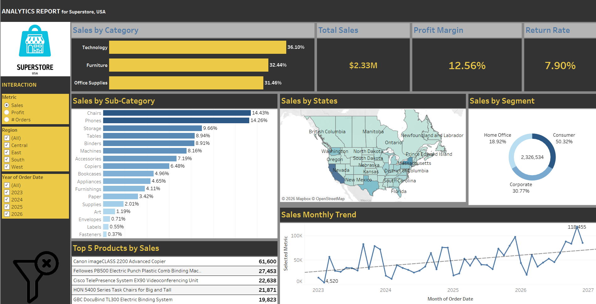
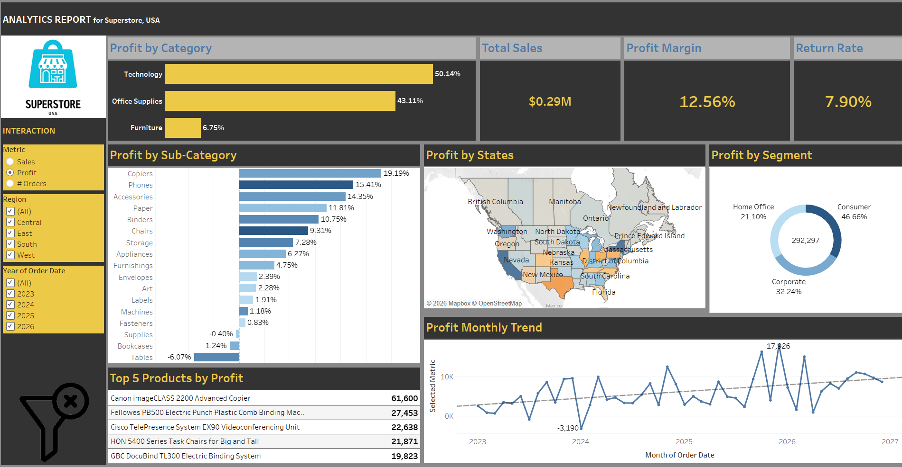
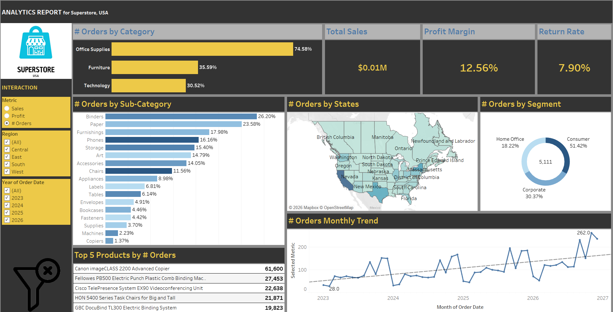
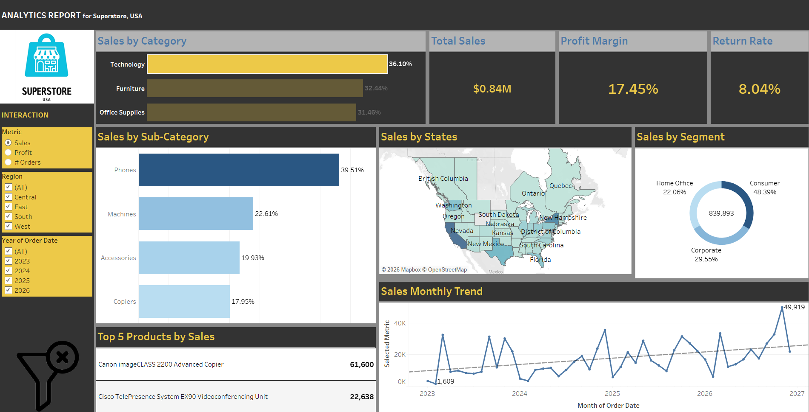

# 📊 Tableau Superstore Sales Dashboard

## 📌 Project Overview

The **Tableau Superstore Sales Dashboard** is an interactive data visualization project developed using Tableau to analyze sales and business performance.

The dashboard provides insights into **Sales, Profit, Orders, Categories, Customer Segments, and Product performance**, helping users understand business trends and identify areas for improvement.

---

## 🎯 Project Objectives

* Analyze overall **Sales and Profit performance**
* Monitor **Order performance**
* Compare different **Product Categories**
* Analyze customer **Segments**
* Identify profitable and underperforming areas
* Understand business performance through interactive Tableau visualizations
* Support data-driven business decision-making

---

## 🛠️ Tools & Technologies

* **Tableau** – Dashboard development and data visualization
* **Microsoft Excel** – Dataset
* **GitHub** – Project hosting and documentation

---

## 📂 Dataset

The project uses the **Sample Superstore dataset**, containing information related to:

* Orders
* Customers
* Products
* Categories
* Sub-Categories
* Sales
* Profit
* Quantity
* Discounts
* States
* Regions
* Customer Segments

**Dataset:** `sample_-_superstore.xls`

---

## 📊 Key Metrics

The dashboard focuses on important business metrics such as:

* 💰 **Sales**
* 📈 **Profit**
* 🛒 **Orders**
* 📦 **Quantity**
* 👥 **Customer Segments**
* 🏷️ **Product Categories**

---

## 📈 Dashboard Features

### 1. Dashboard Overview

Provides a consolidated view of the major business performance indicators and visualizations.



---

### 2. Profit Analysis

The Profit Metric visualization helps analyze profitability and understand business performance.



---

### 3. Orders Analysis

The Orders Metric provides an overview of order performance and helps identify business trends.



---

### 4. Action Filter

Interactive action filters allow users to explore specific parts of the dashboard and dynamically analyze the data.



---

## 🔍 Key Insights

The dashboard can help identify:

* Overall sales and profit performance
* Order trends and business activity
* High-performing product categories
* Profitable and underperforming areas
* Customer segment performance
* Opportunities for improving business profitability
* Patterns and trends that can support business decisions

---

## 🖥️ Tableau Dashboard

The interactive dashboard was created using **Tableau**.

**Tableau Public:**
`PASTE-YOUR-TABLEAU-PUBLIC-LINK-HERE`

> Replace the above placeholder with your actual Tableau Public dashboard link.

---

## 📁 Project Structure

```text
Tableau-Superstore-Sales-Dashboard/
│
├── Dashboard/
│   ├── .gitkeep
│   └── Project.twbx
│
├── Data/
│   ├── .gitkeep
│   └── sample_-_superstore.xls
│
├── Images/
│   ├── .gitkeep
│   ├── 01-Dashboard-Overview.png
│   ├── 02-Profit-Metric.png
│   ├── 03-Orders-Metric.png
│   └── 04-Action-Filter.png
│
└── README.md
```

---

## 🚀 How to Explore the Project

1. Download or clone this repository.
2. Open `Dashboard/Project.twbx` using Tableau Desktop.
3. The workbook uses the Superstore dataset for analysis.
4. Explore the dashboard using the available filters and interactive visualizations.
5. Analyze Sales, Profit, Orders, Categories, Segments, and other business metrics.

---

## 💡 Business Value

This project demonstrates how **data visualization and business intelligence** can transform raw sales data into meaningful insights.

The dashboard can help organizations:

* Monitor business performance
* Track sales and profitability
* Analyze customer segments
* Identify high-performing products
* Find areas of low profitability
* Make data-driven decisions

---

## 👨‍💻 Author

**Hema Narendra Reddy Narala**

**Data Analyst | Data Science Enthusiast**

### Skills Demonstrated

`Tableau` `Data Visualization` `Data Analysis` `Excel` `Business Intelligence` `Dashboard Development`

---

## ⭐ Project

If you find this project useful, consider giving the repository a ⭐ on GitHub.

